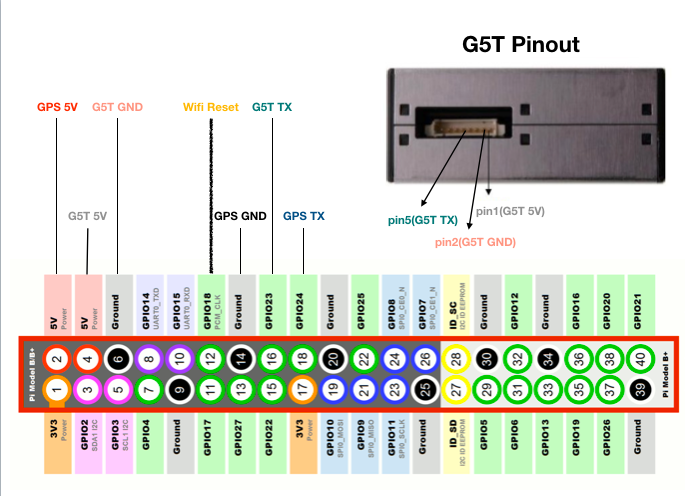

# airbox-pi
## create a airbox to detect pm2.5 with raspberry pi

## Pinout

```
##############################################################             
#           Raspberry Pi 3 GPIO Pinout;           Corner --> #
#                    (pin 1)  | (pin 2)                      #                  
#           Vcc       +3.3V   |  +5.0V    G5T Vcc            #
#                    GPIO  2  |  +5.0V    GPS NEO6 Vcc       #     
#                    GPIO  3  |  GND      G5T GND            #
#                    GPIO  4  | UART TX                      #
#                     GND     | UART RX                      #
#                    GPIO 17  | GPIO 18   Wifi_Reset         #
#                    GPIO 27  |  GND      GPS NEO6 GND       #
#                    GPIO 22  | GPIO 23   G5T Tx             #
#                     +3.3V   | GPIO 24   GPS NEO6 Tx        #
#                    GPIO 10  |  GND                         #
#                    GPIO  9  | GPIO 25                      #
#                    GPIO 11  | GPIO  8                      #
#                     GND     | GPIO  7                      #
#                    Reserved | Reserved                     #
#                    GPIO  5  |  GND                         #
#                    GPIO  6  | GPIO 12                      #
#                    GPIO 13  |  GND                         #
#                    GPIO 19  | GPIO 16                      #
#                    GPIO 26  | GPIO 20                      #
#                     GND     | GPIO 21                      #
#                   (pin 39)  | (pin 40)                     #                  
##############################################################
```
## Logo


## Contributors
[Tzu Heng, Huang](https://github.com/zihengh1) <br>
[Phil Alive](https://github.com/x1001000)

## Organization
[Academia Sinica, Network Research Lab](https://sites.google.com/site/cclljj/NRL)

